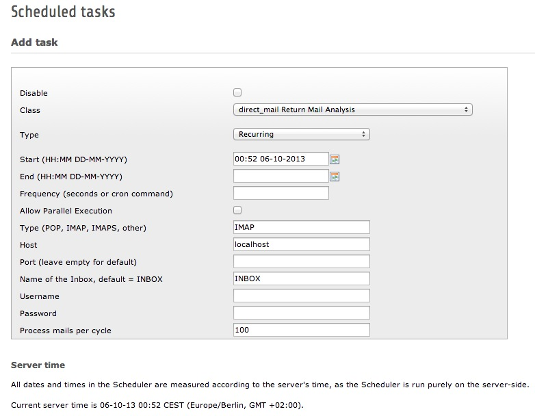

.. ==================================================
.. FOR YOUR INFORMATION
.. --------------------------------------------------
.. -*- coding: utf-8 -*- with BOM.

.. _admin-manual:

Administrator Manual
====================

Configuration
-------------

Setup a mailbox and configure the direct_mail Module to use this mailbox as ReturnPath. See section “Configuring the analysis of returned mails” in the direct_mail manual for details. You now can use this extension to fetch returned mails from this mailbox without the use of fetchmail.

Create a task in the scheduler module and fill the required fields:

:Type: type of the mailbox use IMAP, POP or IMAPS
:Port: the port used to connect to the server. Leave empty for default port.
:Inbox: is the name of the Inbox usually “INBOX”.
:Host: mail server.
:Username and Password: are used to open the connection. **Note:** Password is saved unencrypted in the database and can be read by any TYPO3 admin user in the scheduler task form!
:Process mails per cycle: define how many mails per run the script will process.

	Scheduler Task

