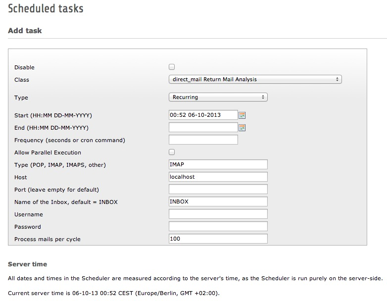

.. ==================================================
.. FOR YOUR INFORMATION
.. --------------------------------------------------
.. -*- coding: utf-8 -*- with BOM.

.. include:: ../Includes.txt

What does it do?
================

This extension is based on EXT:sl_direct_mail_return from Mirko Schaal. All functionality is moved into a scheduler task.
It does the same like the returnmail.phpsh script which is shipped with the direct_mail extension except it uses php imap functions to fetch returned mails from your pop3/imap mailbox. So no fetchmail installation/configuration is required on your server.

	Scheduler Task

